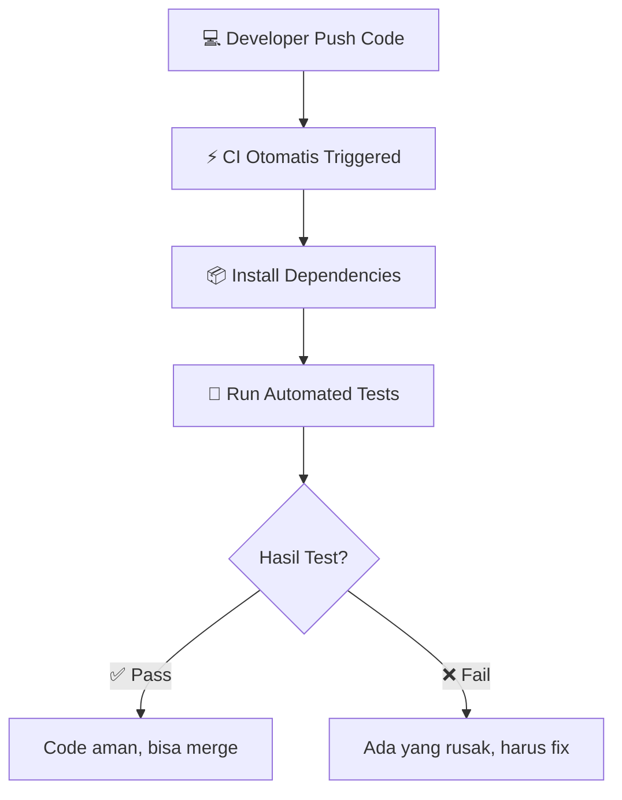
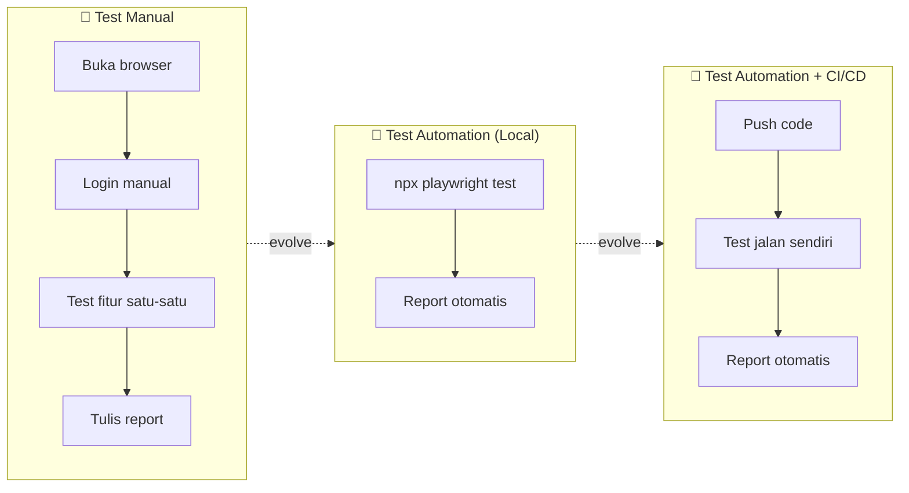

# CI/CD with GitHub Actions + Docker
## QA Engineering — Automation Bootcamp Session 5

---

# Agenda Hari Ini (1 jam 45 menit)

| Session | Durasi | Aktivitas |
|---------|--------|-----------|
| Pembukaan & Daily Standup | 20 menit | Absensi, review session lalu |
| Materi CI/CD + Docker | 45 menit | Teori & live demo |
| Hands-On Practice | 30 menit | Peserta praktik langsung |
| Tanya Jawab | 10 menit | Diskusi & closing |

**Target akhir:** Peserta bisa membuat GitHub Actions workflow yang menjalankan Playwright tests menggunakan Docker image, melihat test berjalan, dan download report.

---

# 1. Apa itu CI/CD? (5 menit)

## Definisi Singkat

**CI/CD** = Continuous Integration + Continuous Deployment

| Istilah | Arti Sederhana |
|---------|----------------|
| **CI** | Setiap push code → otomatis jalanin test |
| **CD** | Test lolos → otomatis deploy ke server |

## Kenapa QA Harus Tahu CI/CD?

> "Daripada jalankan `npx playwright test` manual setiap hari, lebih baik test jalan sendiri otomatis setiap ada code baru."

- 🐛 **Deteksi bug lebih awal** — ketahuan sebelum masuk production
- ⚡ **Feedback cepat** — langsung tahu kalau code bikin test gagal
- 🔁 **Konsisten** — test suite yang sama jalan setiap kali, tidak ada yang terlewat
- 🏆 **Portfolio** — badge hijau di README nilainya tinggi buat interviewer

## Flow CI Sederhana



---

# 2. GitHub Actions (5 menit)

## Apa itu GitHub Actions?

**GitHub Actions** = CI/CD bawaan GitHub. Gratis untuk repo publik.

## Yang Perlu Tahu

- Konfigurasi pakai file **YAML** (bukan kode programming)
- Trigger otomatis saat **push** atau **pull request**
- Bisa juga dijalankan **manual**
- Bisa pakai **Docker container** sebagai environment test

## Analogi untuk QA Manual



---

# 3. Struktur Workflow YAML (10 menit)

## Lokasi File

```
your-repo/
├── .github/
│   └── workflows/
│       └── ci.yml              ← Workflow harus di sini
├── tests/
├── package.json
└── Dockerfile
```

> Folder `.github/workflows/` wajib. Kalau salah tempat, GitHub Actions tidak akan detect.

## Anatomi Workflow YAML

```yaml
name: CI Pipeline              # 1. Nama workflow

on:                            # 2. Kapan di-trigger
  push:
    branches: [main, master]
  workflow_dispatch:            # Bisa trigger manual

jobs:                          # 3. Job yang dijalankan
  test:                        # Nama job
    runs-on: ubuntu-latest     # 4. OS runner
    container:                 # 5. Docker container
      image: mcr.microsoft.com/playwright:v1.58.2-jammy
      options: --user root
    steps:                     # 6. Langkah-langkah
      - name: Checkout code
        uses: actions/checkout@v4

      - name: Install dependencies
        run: npm ci

      - name: Run Playwright tests
        run: npx playwright test
```

## Trigger yang Sering Dipakai

| Trigger | Kapan Jalan | Contoh |
|---------|-------------|--------|
| `push` | Saat push ke branch | Test di main branch |
| `pull_request` | Saat buat/update PR | Validasi sebelum merge |
| `workflow_dispatch` | Manual button | On-demand testing |

```yaml
on:
  push:
    branches: [main]
  workflow_dispatch:
```

---

# 4. Docker di CI/CD (10 menit)

## Apa itu Docker?

**Docker** = Cara untuk mempacking aplikasi + semua dependency-nya menjadi satu **image** yang bisa jalan di mana saja.

### Analogi Sederhana

```
Docker Image = Flashdisk yang isinya:
  - Node.js
  - NPM dependencies
  - Playwright + browser
  - Source code test kamu
  - docker.sh (script runner)

Docker Container = Kalau flashdisk itu di-plug-in dan dijalankan
```

### Kenapa Pakai Docker di CI?

| Tanpa Docker | Dengan Docker |
|--------------|---------------|
| Install semuanya setiap run (5-10 menit) | Semua sudah ada di image (1-2 menit) |
| Environment bisa beda lokal vs CI | Environment **sama persis** |
| Kadang ada dependency conflict | Terisolasi, tidak conflict |

## Two-Stage Pipeline

```
STAGE 1: Build Base Image (dilakukan sekali saja)
┌─────────────────────────────────────┐
│  Build Docker image                 │
│  (bake-in: Node, Playwright, deps)  │
│  Push ke Docker Hub                 │
└──────────────┬──────────────────────┘
               │ image sudah siap
               ▼
STAGE 2: Run Tests (otomatis setiap push/PR)
┌─────────────────────────────────────┐
│  Pull image dari Docker Hub         │
│  Jalankan Playwright tests          │
│  Upload hasil test (artifact)       │
└─────────────────────────────────────┘
```

## File yang Terlibat

| File | Fungsi |
|------|--------|
| `Dockerfile` | Resep untuk bikin Docker image |
| `docker.sh` | Script yang jalan saat container start |
| `docker-build-base.yml` | Workflow untuk build & push image ke Docker Hub |
| `ci.yml` | Workflow untuk run tests pakai image tersebut |

---

# 5. Live Demo — Step by Step (15 menit)

> **PENTING:** Image sudah di-pre-build oleh instruktur sebelum kelas.
> Peserta langsung fokus ke Stage 2 (ci.yml).

## Demo Step 1: `Dockerfile`

```dockerfile
FROM node:20

WORKDIR /app

ENV PATH /app/node_modules/.bin:$PATH

COPY package*.json ./
RUN npm ci

COPY . /app/
RUN chmod +x /app/docker.sh

USER root

RUN npx playwright install --with-deps

ENV PLAYWRIGHT_BROWSERS_PATH=0

ENTRYPOINT [ "/app/docker.sh" ]
```

| Instruction | Fungsi |
|-------------|--------|
| `FROM node:20` | Pakai base image Node.js 20 |
| `WORKDIR /app` | Set working directory |
| `COPY + RUN npm ci` | Install dependencies |
| `RUN npx playwright install --with-deps` | Install browser Playwright |
| `ENTRYPOINT` | Script yang otomatis jalan saat container start |

## Demo Step 2: `docker.sh`

```bash
#!/bin/bash
echo "🚀 Running Playwright tests..."
npx playwright test
```

## Demo Step 3: `docker-build-base.yml` (Instructor only — sudah di-run)

```yaml
name: Build Base Docker Image

on:
  workflow_dispatch:

jobs:
  build_base:
    name: 🐳 Build Base Image
    runs-on: ubuntu-latest
    steps:
      - name: Checkout Repository
        uses: actions/checkout@v4

      - name: Login to Docker Hub
        env:
          DOCKERHUB_USERNAME: ${{ vars.DOCKERHUB_USERNAME }}
          DOCKERHUB_TOKEN: ${{ secrets.DOCKERHUB_TOKEN }}
        run: echo "$DOCKERHUB_TOKEN" | docker login -u "$DOCKERHUB_USERNAME" --password-stdin

      - name: Build and Push Base Image
        run: |
          docker build -t $DOCKERHUB_USERNAME/YOUR_REPO_NAME:base .
          docker push $DOCKERHUB_USERNAME/YOUR_REPO_NAME:base
        env:
          DOCKERHUB_USERNAME: ${{ vars.DOCKERHUB_USERNAME }}
```

> Instruksi setup Docker Hub credentials ada di bagian Hands-On.

---

# 6. Hands-On (30 menit)

## Task 1: Setup Docker Hub Credentials (5 menit)

### 1a. Buat Docker Hub Account (kalau belum punya)

Buka [hub.docker.com](https://hub.docker.com) → Sign up

### 1b. Buat Access Token

```
Docker Hub → Account Settings → Security → New Access Token
→ Name: github-actions
→ Permissions: Read, Write, Delete
→ Copy token yang muncul
```

### 1c. Tambahkan ke GitHub Repo

```
GitHub Repo → Settings → Secrets and variables → Actions
```

| Tipe | Name | Value |
|------|------|-------|
| **Variable** | `DOCKERHUB_USERNAME` | Username Docker Hub kamu |
| **Secret** | `DOCKERHUB_TOKEN` | Token yang tadi di-copy |

---

## Task 2: Buat File Workflow `ci.yml` (5 menit)

Buat file `.github/workflows/ci.yml`:

```yaml
name: Playwright CI Pipeline

on:
  push:
    branches: [main, master]
  pull_request:
    branches: [main, master]
  workflow_dispatch:

jobs:
  test:
    name: 🧪 Run Playwright Tests
    timeout-minutes: 60
    runs-on: ubuntu-latest
    container:
      image: INSTRUKTUR_USERNAME/REPO_NAME:base
      options: --user root
    steps:
      - name: Checkout Repository
        uses: actions/checkout@v4

      - name: Install Dependencies
        run: npm ci

      - name: Run Playwright Tests
        run: |
          cd /app
          bash docker.sh

      - name: Upload Test Results
        uses: actions/upload-artifact@v4
        if: always()
        with:
          name: playwright-report
          path: playwright-report/
          retention-days: 30
```

> ⚠️ Ganti `INSTRUKTUR_USERNAME/REPO_NAME` dengan image name yang disediakan instruktur

---

## Task 3: Push & Trigger (3 menit)

```bash
git add .
git commit -m "feat: add CI pipeline with Docker"
git push
```

Atau trigger manual:

```
GitHub → Actions → "Playwright CI Pipeline" → Run workflow
```

---

## Task 4: Monitor & Download Report (5-10 menit tunggu)

### Monitor

```
GitHub → Actions tab → Click workflow run yang terbaru → View logs real-time
```

### Download Report

1. Tunggu workflow selesai (status: **green** ✅ atau **red** ❌)
2. Scroll ke bawah ke bagian **Artifacts**
3. Download **playwright-report**
4. Extract & buka `index.html` di browser

---

## Task 5 (Bonus): Tambah Badge ke README

Kalau masih ada waktu, edit `README.md`:

```markdown
# Nama Project


```

Hasilnya:

```
[ ✅ passing ]  ← Hijau kalau test pass
[ ❌ failing ]  ← Merah kalau ada test fail
```

---

# Troubleshooting

| Masalah | Solusi |
|---------|--------|
| **Permission denied** | Pastikan ada `options: --user root` |
| **Browser not found** | Pastikan `PLAYWRIGHT_BROWSERS_PATH=0` di Dockerfile |
| **Image not found / pull error** | Cek nama image dan Docker Hub login |
| **npm ci gagal** | Pastikan `package-lock.json` ada di repo |
| **Test timeout** | Tambah `timeout-minutes` di workflow |
| **Workflow tidak muncul** | Cek folder `.github/workflows/` sudah benar |

---

# Summary

## Apa yang Kita Pelajari Hari Ini

| Topik | Key Point |
|-------|-----------|
| **CI/CD** | Test otomatis jalan setiap push code |
| **GitHub Actions** | Platform CI/CD gratis dari GitHub |
| **Workflow YAML** | File konfigurasi pipeline |
| **Docker** | Packaging environment test agar konsisten |
| **Two-Stage Pipeline** | Build image sekali, pakai berkali-kali |

## File yang Ada di Project Kita Sekarang

```
project-root/
├── .github/
│   └── workflows/
│       └── ci.yml                  ← Pipeline yang trigger otomatis
├── Dockerfile                      ← Resep Docker image
├── docker.sh                       ← Script runner
├── tests/
├── playwright.config.ts
└── package.json
```

## Next Steps (Session Berikutnya)

- 🏷️ Test tags — filter test berdasarkan @smoke, @regression
- 📸 Screenshot & Video configuration
- 📱 WhatsApp notification saat test selesai
- 🔍 Code quality check dengan ESLint

---

# Tanya Jawab (10 menit)

Pertanyaan? 🙋

---

**Session 5 Complete!** 🎉
